# FlightSurety

FlightSurety is a sample application project for Udacity's Blockchain course.

## Install

This repository contains Smart Contract code in Solidity (using Truffle), tests (also using Truffle), dApp scaffolding (using HTML, CSS and JS) and server app scaffolding.

To install, download or clone the repo, then:

`npm install`
`truffle compile`

## Develop Client

To run truffle tests:

`truffle test ./test/flightSurety.js`
`truffle test ./test/oracles.js`

To use the dapp:

`truffle migrate`
`npm run dapp`

To view dapp:

`http://localhost:8000`

## Develop Server

`npm run server`
`truffle test ./test/oracles.js`

## Deploy

To build dapp for prod:
`npm run dapp:prod`

Deploy the contents of the ./dapp folder

## Navigate through the DAPP

To an esier navigation, the page is divided in different sections:
* Airline actions
* Flight actions
* Passenger actions
* Oracle actions
* Logs

Every time an action is performed, a log will be displayed at the bottom "Logs" section. 

### The basic steps to navigate and use the DAPP are the following:

1) Open site with Metamask enabled and with contract owner account selected. Operational status should be displayed as true at logs (refresh page otherwise).

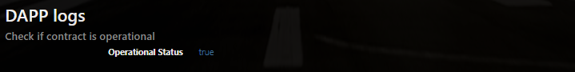

2) Add funds to activate the account. Minimum of 10 eth are required.

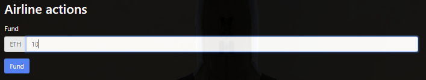

3) Register an airline introducing account address and name.
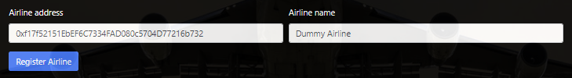
   Then, an OK message will be logged and it will be added to airlines combobox
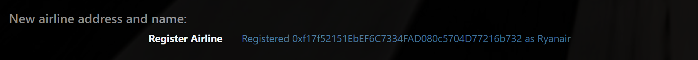
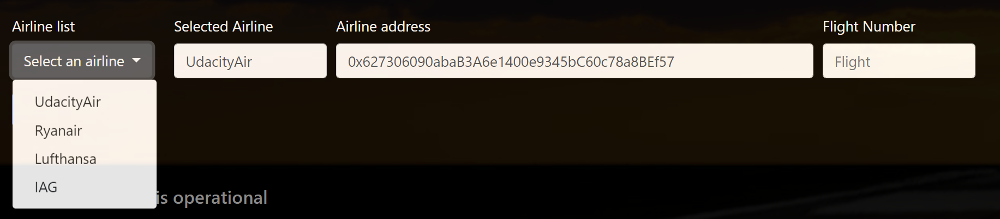
When registering the fifth airline, voting system starts and a log wil warn about it. Once the airline has 4 votes, it will be added as previous ones.

4) Select in Metamask the new airline account.
5) Add funds to the new airline.
6) Register a flight introducing Flight Code and Destination. Click on the flight code to copy on clipboard.

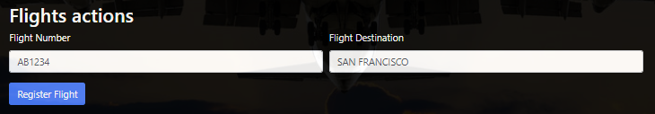
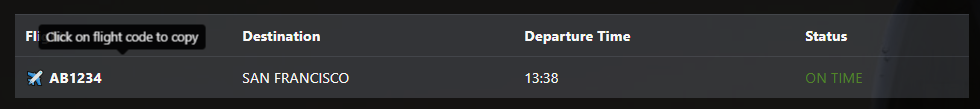

7) Switch in metamask to a third account, to be used as a passenger.
8) Paste or write flight code and set the amount of ethers we want to pay for a flight insurance, and then click on "Buy".

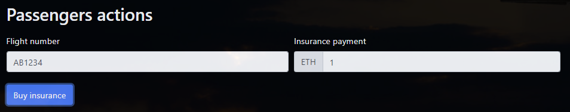

9) Oracles working on server will return a specific status. By default, it is "ON TIME", but it can be changed clicking on Oracle Simulation status buttons. Click on "LATE AIRLINE" to be able to finish this circuit.

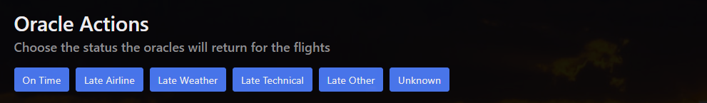
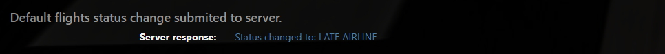

10) Paste flight code on Oracles sections Flight Number box, select correct airline in dropdown menu and click on "Submit to Oracles". After few seconds, flight status will be updated in the flights display panel.

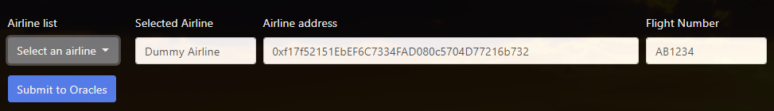
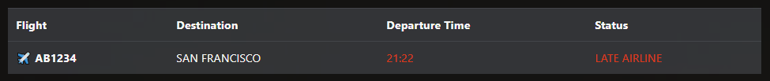

11) With the passenger account selected in Metamask, click on "Check credit". It will show payed insurance amount multiplied by 1.5.

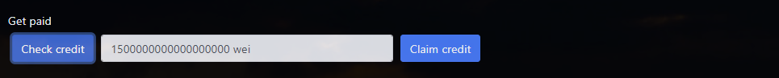

12) Clicking on "Claim Credit" passenger will withdraw the credit and it will be added to its account.

## Resources

* [How does Ethereum work anyway?](https://medium.com/@preethikasireddy/how-does-ethereum-work-anyway-22d1df506369)
* [BIP39 Mnemonic Generator](https://iancoleman.io/bip39/)
* [Truffle Framework](http://truffleframework.com/)
* [Ganache Local Blockchain](http://truffleframework.com/ganache/)
* [Remix Solidity IDE](https://remix.ethereum.org/)
* [Solidity Language Reference](http://solidity.readthedocs.io/en/v0.4.24/)
* [Ethereum Blockchain Explorer](https://etherscan.io/)
* [Web3Js Reference](https://github.com/ethereum/wiki/wiki/JavaScript-API)

# Program version numbers

* Node.js v6.14.4
* Solidity v0.4.25
* Truffle v5.1.27
* Ganache v6.10.0-beta.2
* truffle-hdwallet-provider v1.0.2
* Web3 v1.2.6